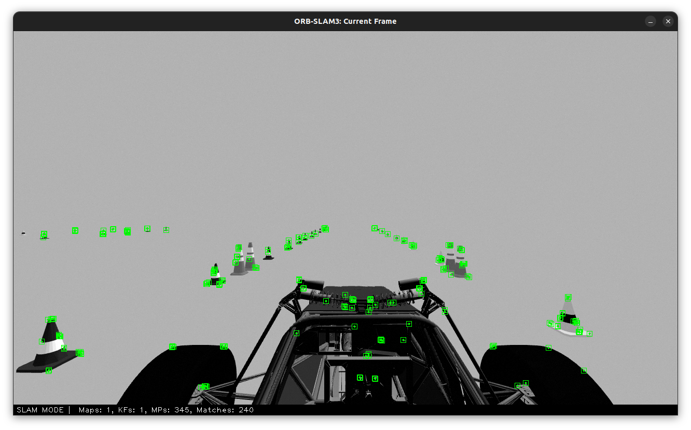
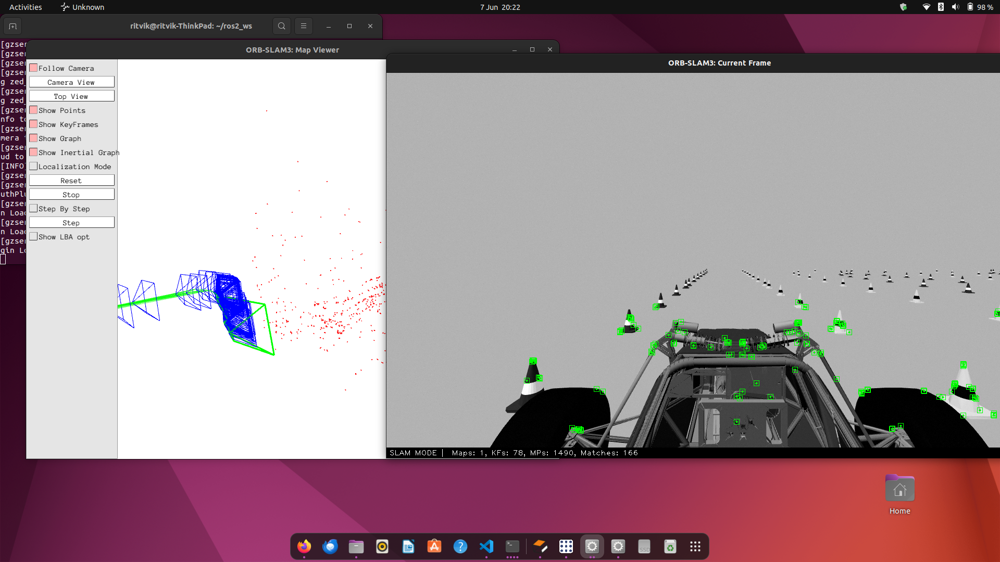
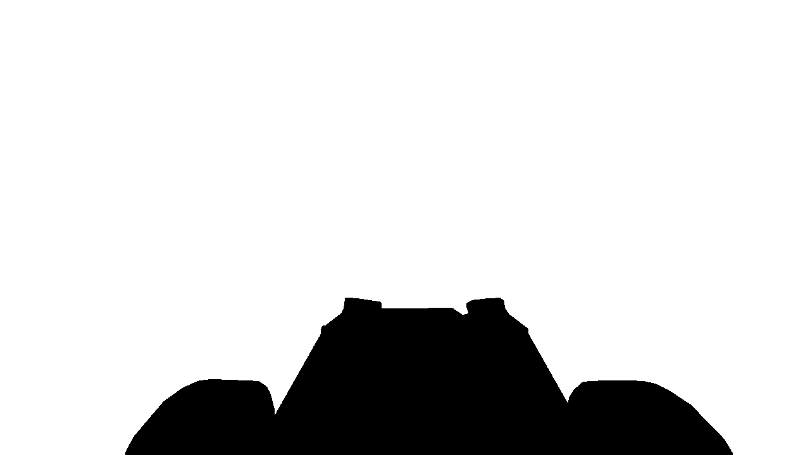
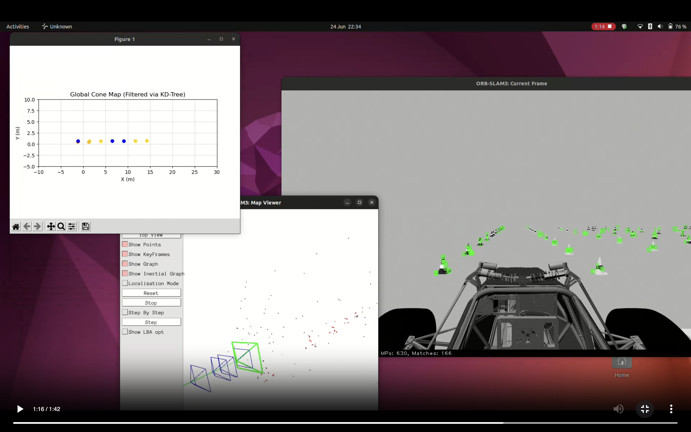
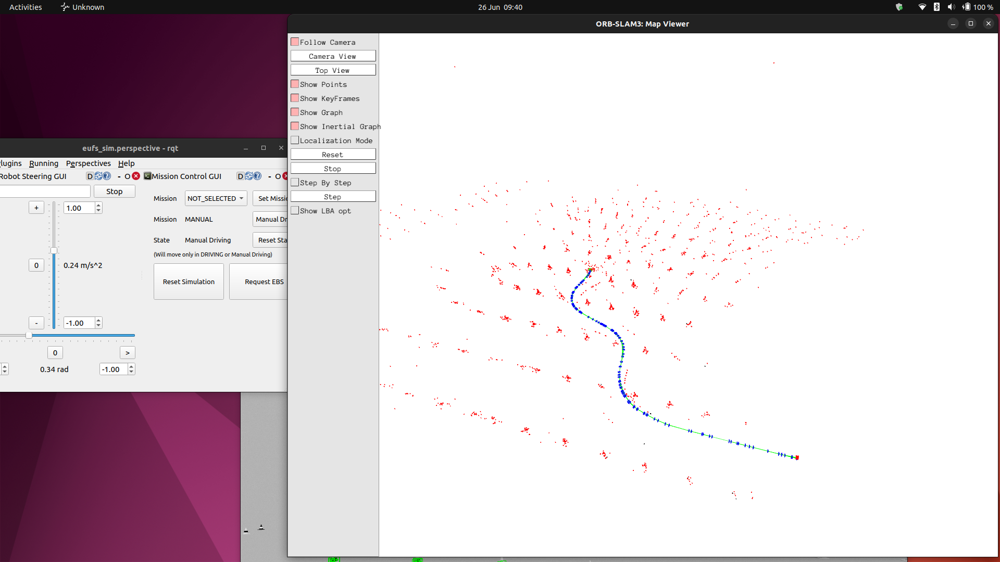

# Cardiff Autonomous Racing FS-AI 2025: Perception Stack

Real-time ROS2 based cone detection and mapping system for an autonomous race car.

## Overview
The racetrack is unknown, lined with different colour cones and the fastest time to complete 10 laps wins. This perception system processes images from a stereo camera to detect cones, fuses stereo and IMU data to localise the car and apply transformations to create a map of the track. The rest of the autonomous stack consists of a path planning, control and car interface modules. The system runs on the IMechE ADS-DV platform with limited compute (GTX 1050Ti, 16GB RAM) while maintaining real-time performance.

**Packages**
- cone_detector: utilises a trained YOLOv8 model to detect cones in camera frames and assigns 3D coordinates to cones using the ZED2i depth images

- orbslam_masked: Uses ORBSLAM3 and fuses stereo vision and IMU data to localise the camera (attached to car) and publishes odometry pose of the car

- cone_mapper: transforms the 3D cone coordinates in the camera frame to the world frame using the odometry pose of camera. Applies temporal filtering, KD tree matching, positional filtering to create a clean, robust map of the cones. Additionally, generates the track edges and centreline.

## Dependencies

Install these system packages first:

```
sudo apt install libeigen3-dev libpangolin-dev libopencv-dev
```
Need to clone and build:

- ORB-SLAM3

- Pangolin

Clone into workspace with:

```
cd ~/ros2_ws
git clone https://github.com/UZ-SLAMLab/ORB_SLAM3.git
git clone https://github.com/stevenlovegrove/Pangolin.git
```

## Running the System

Build the workspace:

```
colcon build --symlink-install
source install/setup.bash
```

In each new terminal:

```
source yourworkspace/install/setup.bash

```
Launch simulation:

```
export EUFS_MASTER=true
ros2 launch eufs_tracks track.launch.py
```
Launch cone detection node:

```
ros2 run cone_detector cone_detector_node
```
Launch SLAM:

```
ros2 launch orbslam_masked orbslam_masked.launch.py
```

Launch cone mapping node:

```
ros2 run cone_mapper cone_mapper
ros2 run cone_mapper map_visual

```

# ORB-SLAM3 fork for cardiff autonomous racing

## Modification summary

Features detected on the vehicle itself (chassis, mirrors, wheels) appear stationary relative to the camera and degrade odometry accuracy, particularly after several metres of trajectory estimation. So a mask outlining the car is applied to remove tracking of the orb key features in this region. 

### Before Masking
| Features before masking | Trajectory before masking |
|----------|------------|
|  |  |
| *ORB features detected on car create static landmarks* | *SLAM odometry degrades due to stationary features* |

**Implementation**: Features are extracted from the frame as normal and then filtered using binary masks. This occurs before the tracking pipeline unwanted features are removed early on. But also without the need to change the frame construction and so it is an efficient and less invasive way of masking. [**More details**](MASKING_IMPLEMENTATION.md)

Binary mask of car:



*Stereo vision is used so both left and right camera image masks were created and passed*

### After Masking
| Features after masking | Trajectory after masking |
|----------|------------|
|  |  |
| *Binary mask removes vehicle features whilst preserving as many other features as possible* | *Improved trajectory accuracy and consistency with dynamic features only* |
